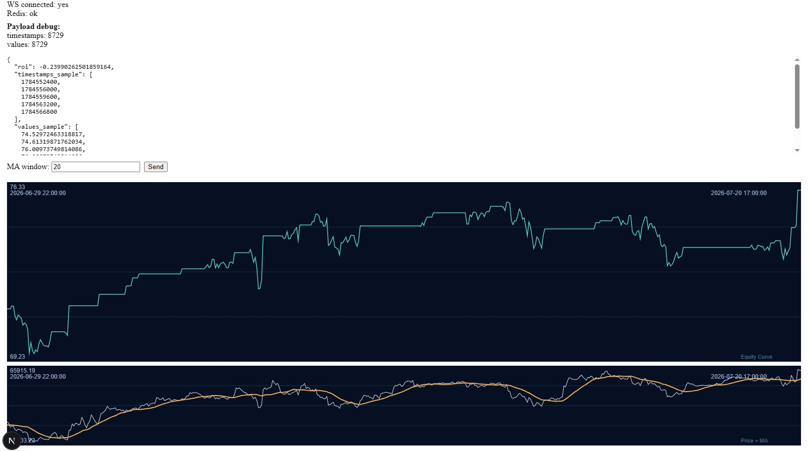

<<<<<<< HEAD
# OddBot — Strategy Backtesting Playground

A moving average crossover **backtesting** visualizer. Tweak a parameter on the frontend, and the backend instantly simulates the strategy against historical Yahoo Finance data and plots the results.

This app was an initial build out to eventually include an AI based decisision and benchmark engine. 


=======
## Project 

Designed for high-frequency strategy backtesting and eventually execution. 

## The Architecture:

### 1. Frontend

- **Framework:** **Next.js (React)**. Handles the UI shell, routing, and user state.
- **Visualization Engine:** **Apache ECharts**.
  - **Role:** Renders massive financial datasets (millions of data points) at 60 FPS.
  - **Mechanism:** Uses WebGL and WebAssembly (Wasm).
  - **Optimization:** Bypasses standard JSON parsing. Accepts **Raw Memory Buffers** (Float64Arrays) directly from the backend for zero-copy rendering.

### 2. Backend (Compute)

- **Runtime:** **Python 3.13**.
- **API Server:** **FastAPI** running on **Uvicorn**. Optimized for asynchronous WebSocket handling. Inside local Docker.
- **Math Engine:** **VectorBT**.
  - **Role:** Performs vectorized backtesting and signal generation using NumPy/Pandas.
  - **Optimization:** Operates entirely on in-memory arrays. Avoids iterative loops.
- **Data Source:** **YFinance** (for MVP data fetching- Very basic / Free) / CCXT/Alpaca for live execution, not integrated yet.

### 3. Comms Layer

- **Transport:** **WebSockets** Maintains a persistent, open pipe between Client and Server.
- **Serialization:** **MessagePack (MsgPack)**.
  - **Role:** Compresses data into binary format.
  - **Data Type:** Transmits **Binary Arrays** (Float64).
  - **Flow:** Python (NumPy Array) $\to$ MsgPack $\to$ WebSocket $\to$ JS (Float64Array) $\to$ ECharts (Wasm Memory).

### 4. State & Caching

- **Redis**.
- **Deployment:** Local **Docker** container (`redis:latest` on port `6379`).
- **Role:** Acts as the "Hot Path"
  - Stores active user session state.
  - Caches market data to prevent repeated fetching during strategy iteration.
  - Ensures parameter adjustments trigger sub-50ms recalculations.
>>>>>>> 113eb75f0054743805d74921a67505971d4cc9b4

---

## Quick Start

<<<<<<< HEAD
### Prerequisites
- **Docker** — for Redis caching (optional, falls back to in-memory cache)
- **Python 3.13** with `venv`
- **Node.js** with `npm`

### 1. Start Redis (optional but recommended)
```sh
docker run -d --name local-redis -p 6379:6379 redis:latest
```
Or if already created:
```sh
docker start local-redis
```

### 2. Backend
```sh
# Activate venv (path may differ)
backend\venv\Scripts\Activate.ps1

# Start the API server
python -m uvicorn backend.main:app --reload --host 0.0.0.0 --port 8000
```

### 3. Frontend
```sh
cd frontend
npm run dev
```

Open `http://localhost:3000` in your browser.
=======
1.  **User Action:** User adjusts a strategy parameter (e.g., RSI threshold) in the Next.js UI (TBD)
2.  **Binary Request:** Frontend packs the parameter into a binary message via **MsgPack** and sends it over the **WebSocket**.
3.  **In-Memory Calc:** FastAPI receives the binary, unpacks it, and triggers **VectorBT**.
4.  **Vectorized Processing:** VectorBT recalculates the strategy using cached data in **RAM/Redis** (no SQL or disk I/O).
5.  **Binary Response:** The resulting equity curve and signals are packed into a binary array.
6.  **Direct Rendering:** **ECharts** receives the binary stream and dumps it directly into WebGL memory for an instant chart update.
>>>>>>> 113eb75f0054743805d74921a67505971d4cc9b4

---

## Configuration

Edit `backend/config.json` to change the market data source without touching any code:

<<<<<<< HEAD
```json
{
    "symbol": "BTC-USD",
    "period": "1y",
    "interval": "1h"
}
```
=======
- **Manager:** `venv` (Virtual Environment).
- **Core Libraries:**
  - `fastapi`, `uvicorn`: ASGI Server.
  - `websockets`: Communication.
  - `vectorbt`: Quant logic.
  - `numpy`, `pandas`: Data structures.
  - `msgpack`: Binary serialization.
  - `redis`: Cache interface.
  - `yfinance`: Market data. - Slow but good for Dev
>>>>>>> 113eb75f0054743805d74921a67505971d4cc9b4

### Common Values

| Field | Examples | Notes |
|---|---|---|
| `symbol` | `BTC-USD`, `ETH-USD`, `AAPL`, `SPY`, `EURUSD=X` | Any Yahoo Finance ticker |
| `period` | `1d`, `5d`, `1mo`, `3mo`, `6mo`, `1y`, `2y`, `5y`, `ytd`, `max` | How far back to fetch |
| `interval` | `1m`, `5m`, `15m`, `30m`, `1h`, `1d`, `1wk`, `1mo` | Candle resolution |

> **Note:** Yahoo Finance restricts intraday intervals (`1m`–`30m`) to short periods (`1d`–`5d`). Use `1h` or `1d` for longer periods. Replace with a faster source after testing.

<<<<<<< HEAD
---

## How It Works

1. **Backend loads real historical data** from Yahoo Finance at startup (configurable via `config.json`).
2. **Frontend connects** to the backend over a WebSocket and sends a **moving average window** parameter (default: 20).
3. **Backend runs VectorBT** — calculates a simple MA crossover strategy and returns:
   - The **equity curve** (portfolio value over time)
   - The **price data** and **MA line** for visual reference
4. **Frontend renders** a two-pane Canvas chart:
   - **Top pane** — equity curve (how the strategy performed)
   - **Bottom pane** — price with the moving average overlay

The default **simulated** strategy triggers a buy when price crosses **above** the moving average and a sell when it crosses **below**. You can adjust the MA window in the input box and click **Send** to re-run the backtest — the MA line on the bottom pane updates instantly.

> **Note:** This is a historical backtest only. No live trades are executed.

---

## Architecture

### Backend (`backend/`)
- **FastAPI + Uvicorn** — async WebSocket server
- **VectorBT** — vectorized backtesting engine (NumPy/Pandas)
- **YFinance** — market data source
- **MessagePack** — binary serialization over WebSocket
- **Redis** — optional result cache (falls back to in-memory dict)

### Frontend (`frontend/`)
- **Next.js (React)** — UI shell
- **Canvas API** — custom lightweight two-pane chart
  - Top: equity curve (strategy performance)
  - Bottom: price + moving average overlay
- **@msgpack/msgpack** — binary deserialization

### Data Flow
```
Frontend  ──(MsgPack over WebSocket)──▶  Backend
  │                                          │
  │  { ma_window: 20 }                  Runs VectorBT backtest
  │                                          │
  ◀──(MsgPack: { roi, timestamps, values,    │
  │               price_values, ma_values })──┘
  │
  Top pane:    Equity curve
  Bottom pane: Price + MA overlay
```

---

## Project Structure

```
OddBot/
├── backend/
│   ├── main.py        # FastAPI app, WebSocket handler, backtest logic
│   ├── config.json    # Market data config (symbol, period, interval)
│   └── venv/          # Python virtual environment
├── frontend/
│   ├── pages/
│   │   └── index.js      # Main page with WS connection and controls
│   ├── component/
│   │   └── HedgeChart.js  # Two-pane Canvas chart (equity + price/MA)
│   └── package.json
└── readme.md
```
=======
1. Run Docker - Redis `docker start local-redis`
2. Run Python VE: `.\.venv\Scripts\Activate.ps1`
3. Run fastAPI - `uvicorn backend.main:app --reload --host 0.0.0.0 --port 8000`
4. Run react Front End -`npm run dev`

## TODO: Add AI integration, for LLM based contests running on cron

1. Add AI chat interface --> trading schema (zod)
2. Confirm startegy - Loopback (natural language)
3. Turn schema into API request (simulate)
4. Cron every x hours
4. Store in DuckDB
>>>>>>> 113eb75f0054743805d74921a67505971d4cc9b4
